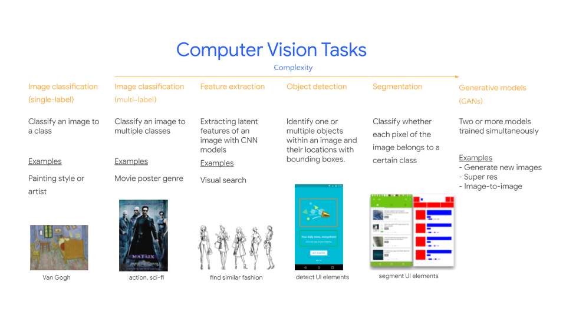

# Awesome AI for Art & Design   

An awesome list of AI for art and design - resources, and popular datasets and how we may apply computer vision tasks to art and design.

## Contents
* [Computer Vision Tasks](#computer-vision-tasks)
* [Community](#community)
* [Datasets](#datasets)
  * [Art data](#art-data)
  * [Design data](#design-data)

## Computer Vision Tasks
Here are some examples of how computer vision tasks can be applied to real world applications in art and design:

## Community
Here is a  list of communities and projects that use AI for art and design:

* [Magenta](https://magenta.tensorflow.org/) - An open source research project exploring the role of machine learning as a tool in the creative process.
* [Artists and Machine Intelligence](https://ami.withgoogle.com/) - A program at Google that brings artists and engineers together to realize projects using Machine Intelligence.
* [Google Arts & Culture](https://artsandculture.google.com/) - A non-profit initiative to preserve and bring the world’s art and culture online, accessible to anyone anywhere. It has cool interative experiments, virtual museums, art collections and more.
* [RunwayML](https://runwayml.com/) - Machine learning for creators where you can [learn](https://learn.runwayml.com/#/) and and share your [projects](https://runwayml.com/madewith/).
* [AI & the Future of UX](https://uxdesign.cc/ai/home) - A collection of blog posts about AI and its impact on the future of UX.

## Datasets
### Art data
* [The Art Institute of Chicago](https://kottke.org/18/11/the-art-institute-of-chicago-has-put-50000-high-res-images-from-their-collection-online) - 5000 high res images.
* [Best Artworks of All Time](https://www.kaggle.com/ikarus777/best-artworks-of-all-time) - A collection of artwork from the best 50 artists.
* [Art Images: Drawing/Painting/Sculptures/Engravings](https://www.kaggle.com/thedownhill/art-images-drawings-painting-sculpture-engraving) - Five types of artwork separated into training and validation datasets.
* [Museum of Modern Art Collection](https://www.kaggle.com/momanyc/museum-collection) - A collection of 72,706 artworks from 20,956 artists.
* [Overwatch Heroes Recognition](https://www.kaggle.com/renanmav/overwatch-heroes-recognition) - 2,291 images of Overwatch heroes with vibrant colors. Great for using as style image in neural network style transfer.
* [Chinese Fine Art](https://www.kaggle.com/rickyjli/chinese-fine-art/) - A small collection of a few hundreds of Chinese style paintings, drawings, watercolors, graphics and iconography.

### Design data
* Rico mobile app datasets - [Rico](https://interactionmining.org/rico) | [paper](http://ranjithakumar.net/resources/rico.pdf).
* [Common Mobile/Web App Icons](https://www.kaggle.com/testdotai/common-mobile-web-app-icons).
* [Icons-50](https://www.kaggle.com/danhendrycks/icons50).
* [The noun project](https://thenounproject.com/).
